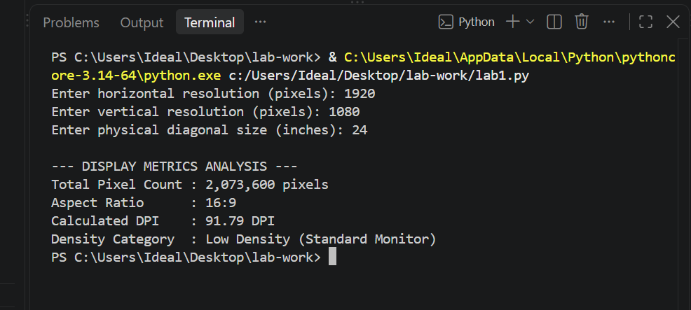
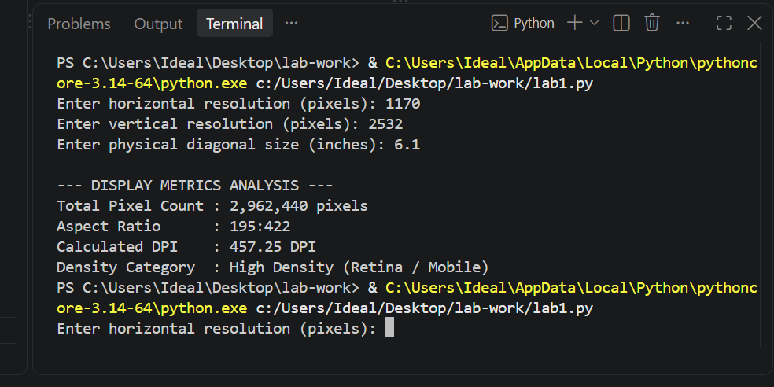
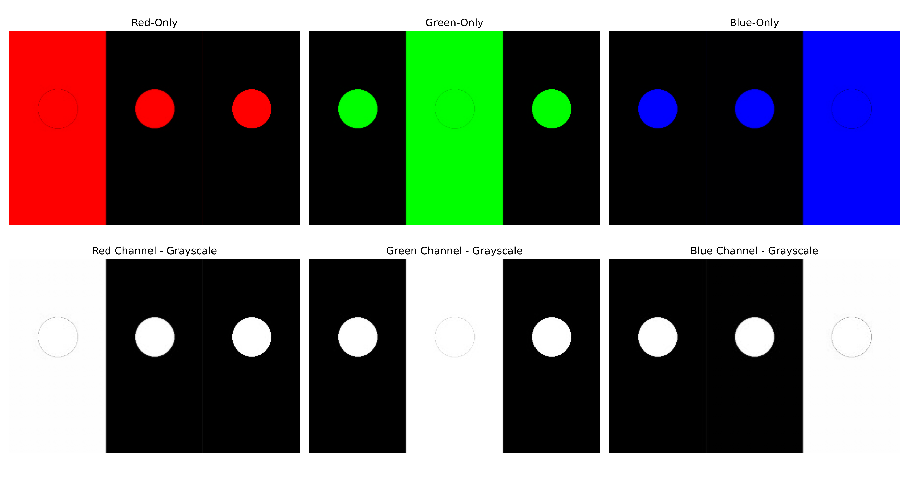
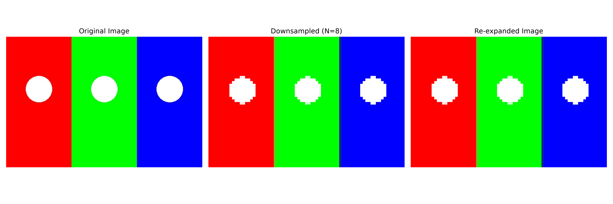

# HCI & Computer Graphics Lab 1
# TASK 1-4

## Display Density Metrics & Image Array Mechanics in NumPy

This project implements the Python tasks from **HCI & Computer Graphics Lab 1**. The lab focuses on display density metrics, NumPy image arrays, RGB channel extraction, and image downsampling.

## Objectives

* Calculate display resolution, total pixels, aspect ratio, and DPI/PPI.
* Understand image representation using NumPy arrays.
* Extract Red, Green, and Blue color channels.
* Create color-only and grayscale channel visualizations.
* Downsample and re-expand an image using NumPy.
* Analyze image memory usage.

## Technologies Used

* Python
* NumPy
* Pillow (PIL)
* Matplotlib
* VS Code

## Files

| File               | Description                                  |
| ------------------ | -------------------------------------------- |
| `lab1.py`          | Calculates display metrics                   |
| `lab2.py`          | Creates a synthetic RGB image using NumPy    |
| `lab3.py`          | Extracts and visualizes RGB channels         |
| `lab4.py`          | Performs image downsampling and re-expansion |
| `sample.jpg`       | Sample image used for Tasks 3 and 4          |
| `task3_output.png` | RGB channel visualization                    |
| `task4_output.png` | Downsampling visualization                   |

## Task 1 — Display Metrics

### Desktop Example

**Input:**

* Resolution: **1920 × 1080 pixels**
* Diagonal: **24 inches**

**Results:**

* Total Pixels: **2,073,600**
* Aspect Ratio: **16:9**
* Calculated DPI: **91.79 DPI**
* Density Category: **Low Density (Standard Monitor)**

### Smartphone Example

**Input:**

* Resolution: **1170 × 2532 pixels**
* Diagonal: **6.1 inches**

The program calculates the total pixels, aspect ratio, DPI, and density category automatically.

## Task 2 — Synthetic Image Matrix

A **300 × 400 × 3** RGB image array was created using NumPy.

The four quadrants contain:

* Top-left: Red
* Top-right: Green
* Bottom-left: Blue
* Bottom-right: White

### Output

* Array Shape: **(300, 400, 3)**
* Data Type: **uint8**
* Total Elements: **360,000**
* Memory Footprint: **360,000 bytes**
* Memory: **351.56 KB**

## Task 3 — RGB Channel Extraction

The sample image was converted into a NumPy array with shape:

**(400, 600, 3)**

The three RGB channels were extracted using NumPy slicing:

* Red channel: `img[:, :, 0]`
* Green channel: `img[:, :, 1]`
* Blue channel: `img[:, :, 2]`

The output contains a **2 × 3 visualization** showing:

* Red-only image
* Green-only image
* Blue-only image
* Red channel in grayscale
* Green channel in grayscale
* Blue channel in grayscale

## Task 4 — Image Downsampling

The image was downsampled using a factor of **N = 8**.

### Results

* Original Shape: **(400, 600, 3)**
* Downsampled Shape: **(50, 75, 3)**
* Re-expanded Shape: **(400, 600, 3)**
* Height Reduction: **87.50%**
* Width Reduction: **87.50%**
* Original Memory: **720,000 bytes**
* Downsampled Memory: **11,250 bytes**
* Memory Savings: **98.44%**

The downsampled image was re-expanded using `np.repeat()`.

## RGBA Memory Question

RGBA increases memory usage by **33.33%** compared to RGB because RGBA stores an additional Alpha channel for transparency.

RGB uses **3 channels per pixel**, while RGBA uses **4 channels per pixel**.

### Calculation

**(4 − 3) / 3 × 100 = 33.33%**

## Screenshots

### Desktop Display Metrics

### Smartphone Display Metrics

### Task 3 - RGB Channel Extraction

### Task 4 - Image Downsampling

## Conclusion

This lab demonstrates how display specifications can be calculated using Python and how digital images are represented as NumPy arrays. RGB channel extraction shows how individual color components can be analyzed, while downsampling demonstrates how reducing image dimensions can significantly reduce memory usage.

